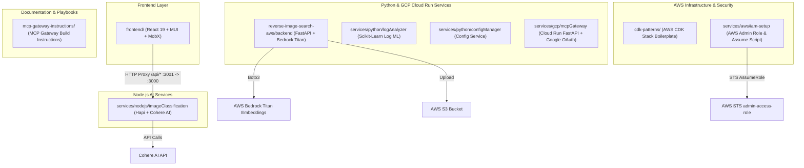

# Architecture & System Boundaries

This document describes the high-level architecture of the `hello-world` repository, explaining how subprojects relate, their status (active vs scaffold vs docs-only), and key integration points.

---

## 🏗️ High-Level System Architecture

---

## 🚦 Area Classification

| Subproject | Category | Current Status | Integration & Dependencies |
|---|---|---|---|
| `frontend/` | Web Application | **Active / Working POC** | React frontend. Uses `setupProxy.js` to route `/api/*` requests to Node.js backend on `http://localhost:3000`. |
| `services/nodejs/imageClassification/` | Backend REST API | **Active / Working POC** | Hapi server listening on port 3000. Uses Cohere AI SDK for image classification and embedding similarity. |
| `reverse-image-search-aws/backend/` | Backend REST API | **Partial POC** | FastAPI service on port 8000. Uploads images to S3 and calls Amazon Titan Multimodal embeddings. OpenSearch k-NN indexing and search are stubs. |
| `reverse-image-search-aws/frontend/` | Web Application | **Scaffold Only** | Placeholder README for a future dedicated reverse image search frontend. |
| `reverse-image-search-aws/infrastructure/` | Infrastructure | **Scaffold Only** | Placeholder AWS CDK TypeScript project for RIS cloud infrastructure. |
| `cdk-patterns/` | Infrastructure | **Scaffold** | Infrastructure as Code boilerplate using AWS CDK v2. Active feature work exists on `feat/cdk-dynamo` branch. |
| `services/python/logAnalyzer/` | Microservice | **Active / Working POC** | Python ML service for log analysis. Dockerized with `docker-compose.yml`. |
| `services/python/configManager/` | Microservice | **Active / Working POC** | Python configuration manager. Dockerized with `docker-compose.yml`. |
| `services/gcp/mcpGateway/` | Microservice | **Active Service** | Cloud Run Remote MCP Gateway (FastAPI + Google OAuth 2.0). Provides SSE transport (`/sse`), Web Fetch, and GCS Memory tools. |
| `services/aws/iam-setup/` | Security & Admin | **Active Tooling** | Shell scripts (`scripts/assume-role.sh`) and instructions to assume IAM role `admin-access-role` on AWS account `908027415245`. |
| `services/curls/` | CLI Scripts | **Reference Tooling** | `helloworld-apigw.sh` fetches API key from AWS Secrets Manager and tests deployed API Gateway endpoint. |
| `mcp-gateway-instructions/` | Documentation | **Docs-Only** | 6-phase instruction set (01-06) for building an MCP Gateway. Contains no application code. |

---

## 🔗 Key Integration Points

1. **Root Frontend -> Node Image Classifier:**
   - **Frontend:** Runs on `localhost:3001` (or `3000` via CRA `npm start`).
   - **Proxy:** `frontend/src/setupProxy.js` forwards `/api` requests to `http://localhost:3000`.
   - **Backend:** `services/nodejs/imageClassification/server.js` listens on `PORT=3000`.

2. **Reverse Image Search Backend -> AWS Services:**
   - **AWS Bedrock:** Invokes `amazon.titan-embed-image-v1` to generate vector embeddings from raw image bytes.
   - **AWS S3:** Uploads images to S3 bucket configured via `S3_BUCKET_NAME`.
   - **OpenSearch:** Stubs in `app/search.py` intended for vector k-NN indexing.

3. **AWS IAM Security Flow:**
   - Script `./services/aws/iam-setup/scripts/assume-role.sh` calls `aws sts assume-role` for `arn:aws:iam::908027415245:role/admin-access-role` using profile `default`.
   - Populates temporary credentials in `~/.aws/credentials` under profile `assumed-admin`.
